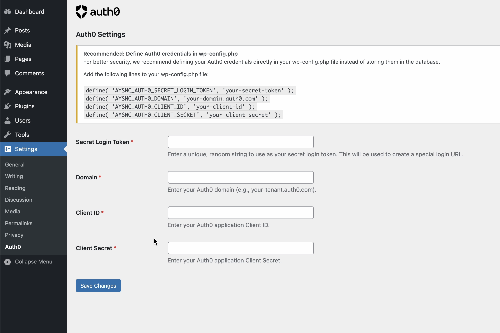
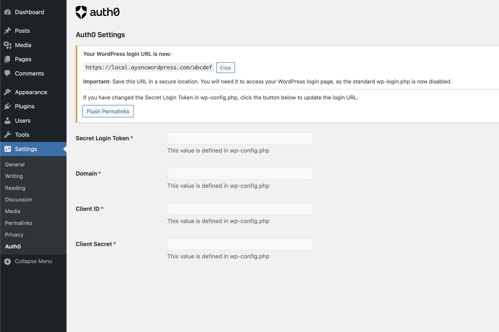

# Login with Auth0 for WordPress


A simple, secure way to log in to WordPress using Auth0. Hides the default login screen with a redirect to Auth0.

## Features

- ✅ Very easy to set up
- 🔒 Replaces the standard WordPress login URL with a secret link for additional security
- 🔑 Authenticates users via Auth0 using OAuth 2.0 / OIDC

## Instructions Video

🍿 [Setup Instructions Video](https://vimeo.com/1104092077)

Watch this video to see how to configure your Auth0 application and hook it up to WordPress.

## Installation

You can install this plugin in one of two ways:

### Option 1: WordPress Plugin Repository (Basic)

Install this plugin via the WordPress Plugin Repository by downloading it from: https://wordpress.org/plugins/aysnc-login-with-auth0/ or by searching for "Aysnc Login with Auth0" in your WordPress admin panel.

### Option 2: Composer (Recommended)

Install this plugin via Composer by running the following command:

```bash
composer require aysnc/aysnc-login-with-auth0
```

## Configuration

You can configure the plugin either through the WordPress admin interface or by defining constants in your wp-config.php file (recommended for enhanced security).

### Option 1: WordPress Admin Configuration (Basic)

1. Go to WordPress Admin > Settings > Auth0
2. Enter the following required information:
   - **Secret Login Token**: A unique, random string that will be used for your custom login URL
   - **Domain**: Your Auth0 domain (e.g., `your-tenant.auth0.com`)
   - **Client ID**: Your Auth0 application Client ID
   - **Client Secret**: Your Auth0 application Client Secret
3. Save changes



### Option 2: wp-config.php Configuration (Recommended)

For enhanced security, add the following lines to your wp-config.php file:

```php
// Auth0 Configuration
define( 'AYSNC_AUTH0_SECRET_LOGIN_TOKEN', 'your-secret-token' );
define( 'AYSNC_AUTH0_DOMAIN', 'your-tenant.auth0.com' );
define( 'AYSNC_AUTH0_CLIENT_ID', 'your-client-id' );
define( 'AYSNC_AUTH0_CLIENT_SECRET', 'your-client-secret' );
```

This method prevents your Auth0 credentials from being stored in the database.



### 🚨 Important: Don't lose your login URL!

After configuring the plugin:

1. Your WordPress login URL will change to: `https://your-wordpress-site.com/your-secret-token`
2. The standard wp-login.php page will be disabled
3. **Save your new login URL in a secure location** - you'll need it to access your WordPress admin area

If you change your Secret Login Token in wp-config.php, use the "Update Login URL" button in the Auth0 settings page to refresh the login URL.

## FAQ

### What happens if I lose my Secret Login Token?

If you've defined it in wp-config.php, you can retrieve it from there. If you've only set it in the WordPress admin, you may need to access your database directly to retrieve it.

### Can I still use the standard WordPress login?

No, the standard wp-login.php is disabled for security reasons. You must use the custom login URL.

### Does this plugin work with multisite?

Yes, the plugin is compatible with WordPress multisite installations.

### What if I need to update my Auth0 credentials?

You can update them either in the WordPress admin interface or in your wp-config.php file, depending on how you initially configured the plugin.
